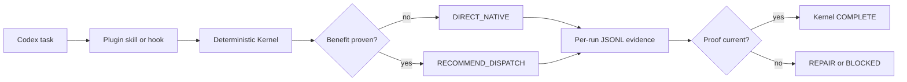

# Architecture

The Kernel is a local decision and evidence engine. It never calls a model to choose a model.

## Boundaries

- The configured Codex root remains the judge and synthesizer.
- Semantic roles are host-resolved; the core knows no model-family ranking.
- V0.1 recommends but does not actuate a selected native subagent.
- A Stop hook may request one continuation, but it cannot guarantee Codex completion behavior. `stop_hook_active` prevents loops.
- State is partitioned under `runs/<run-id>/events.jsonl`; prompt bodies and diffs are not stored.

## Modes

- `observe`: records the counterfactual locally and adds no model context.
- `assist`: may add a byte-capped actionable recommendation.
- `execute`: parsed but locked until a documented actuator and category evaluation pass.
- `govern`: parsed but locked with `execute`.
